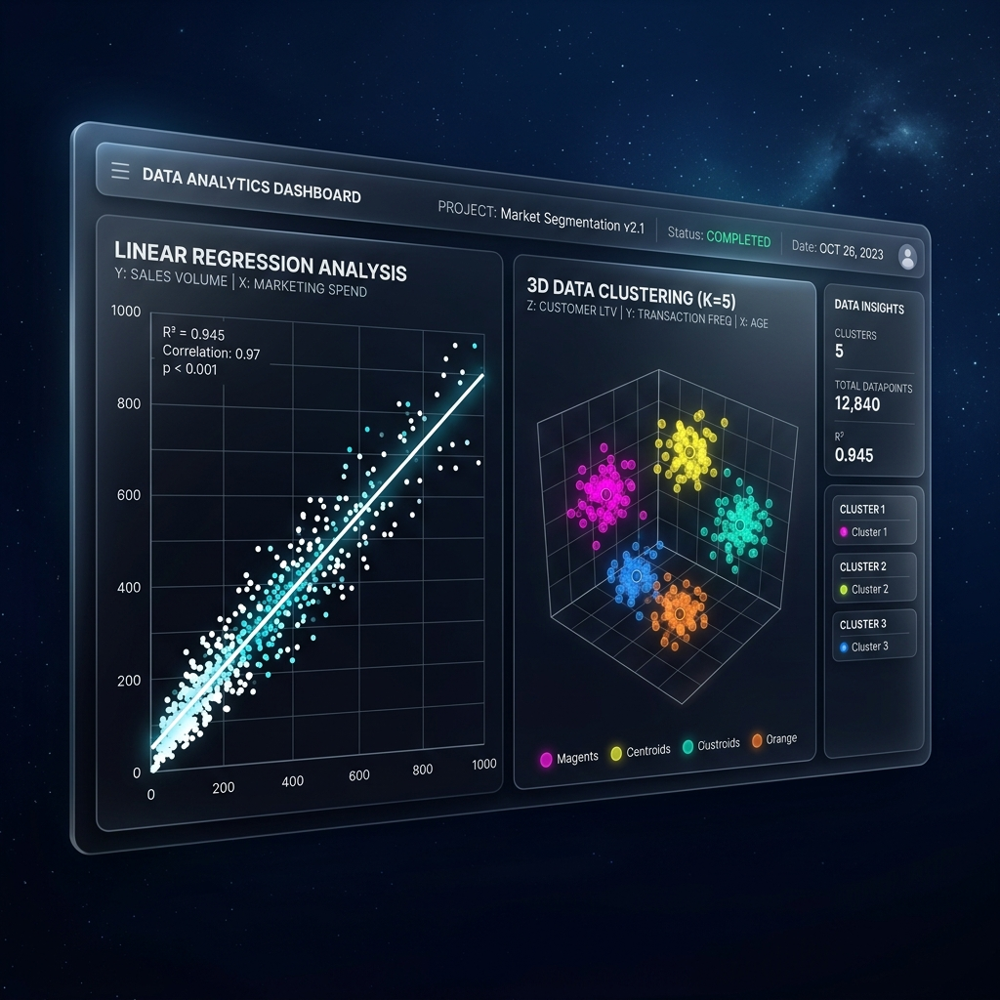

# 🌌 Nova Analytics Engine

> A futuristic, glassmorphic full-stack data intelligence and automated machine learning platform. Upload datasets, run dynamic SQLite queries, plot statistical curves, and cluster spatial features in real-time.

---

## 🎨 UI Showcase

### 📊 Ingestions & Intelligence Dashboard


### 🧠 Auto-ML & Feature Sandbox


---

## 🚀 Key Features

- **🛸 Neural Glassmorphism UI**: High-fidelity dark theme with radial glowing nebulas, frosted translucent cards (`backdrop-filter`), hover micro-interactions, and neon accent lines.
- **🔐 Secure Node Authentication**: Secure registration and session sync with hashed credentials (bcrypt) and signature verification tokens (JWT).
- **📂 Relational Table Compiler**:
  - Drag and drop CSV/JSON datasets.
  - Dynamic schema analyzer with type-inference (auto-detects `INTEGER`, `REAL`, `TEXT`).
  - Automatically generates unique tables and imports records in high-speed transactions.
- **⚡ In-Browser SQL Terminal**:
  - Write standard SQL queries (`SELECT`, `GROUP BY`, `ORDER BY`, `LIMIT`) on uploaded CSVs.
  - Safe execute pipeline (write operations blocked).
  - Schema sidebar mapping assistant.
  - Query history logs and result export (CSV, JSON).
- **🔮 Automated ML & Statistical Engine**:
  - **Linear Regression**: Fits curve lines on correlation arrays, returns slope, intercept, $R^2$ accuracy score, and predicts future values.
  - **K-Means Clustering**: Normalized spatial mapping with centroid iterations and bubble color groupings.
  - **Anomaly Detector**: Z-Score statistical variance scans ($z > \sigma$) to isolate signal outliers.
- **📦 Pre-Loaded Demo Sets**: Load pre-compiled datasets (Sales Data, Customer Segments, Server Telemetry) with a single click.

---

## 🛠️ Technology Stack

- **Frontend**: React, Vite, Chart.js, Lucide Icons, Canvas Confetti.
- **Backend**: Node.js, Express, SQLite3 (persistent file-base), Multer, JWT, BcryptJS.
- **Styling**: Pure Vanilla CSS Custom Design System.

---

## 📂 Repository Structure

```text
/ (Workspace Root)
├── backend/                # Express & SQLite Engine
│   ├── database/           # Persistent SQL data storage
│   ├── uploads/            # Multer file upload storage
│   ├── samples/            # Pre-compiled demo CSV files
│   ├── src/
│   │   ├── controllers/    # API Request controllers (auth, data, query, stats)
│   │   ├── database/       # SQLite db schemas and connection helpers
│   │   ├── routes/         # Express endpoint maps
│   │   └── utils/          # Data parsers & ML calculation algorithms
│   └── package.json
├── frontend/               # React + Vite Client
│   ├── src/
│   │   ├── assets/
│   │   ├── components/     # UI elements (Sidebar, Navbar)
│   │   ├── pages/          # App Views (Auth, Dashboard, Datasets, Explorer, SQL, ML)
│   │   ├── App.jsx         # State orchestrator
│   │   └── index.css       # Glassmorphism Design Tokens
│   └── package.json
├── assets/                 # Readme screenshots and visuals
├── package.json            # Monorepo Concurrent scripts
└── README.md
```

---

## ⚡ Quick Setup & Ingestion

### Prerequisites
- Node.js (v18.x or higher)
- npm (v9.x or higher)

### Installation
Clone the repository and run the monorepo installer from the root directory:
```bash
npm run install:all
```

### Run Server Nodes
Launch both the **Vite Client** and the **Express Backend** concurrently with a single command:
```bash
npm run dev
```

- **Frontend Node**: [http://localhost:5173](http://localhost:5173)
- **Backend Node**: [http://localhost:5000](http://localhost:5000)

---

## 🧪 Terminal Queries Playground

Once you ingest `Sales Performance Data` or upload custom CSV files, open the **SQL Terminal** and run these sample scripts:

### 1. High Sales Segments
```sql
SELECT Segment, SUM(Sales) as total_sales, AVG(Profit) as avg_profit 
FROM data 
GROUP BY Segment 
ORDER BY total_sales DESC;
```

### 2. Discount Impacts on Profits
```sql
SELECT Product, Sales, Profit, Discount 
FROM data 
WHERE Discount > 0.1 
ORDER BY Profit ASC 
LIMIT 10;
```

---

*Engineered with 💜 by Pratyush Pandey*